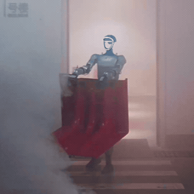
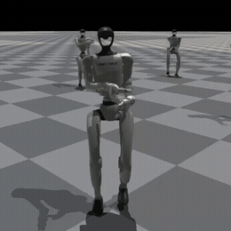
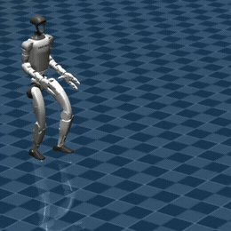

<p align="center">
  
</p>

# Flomo (Foundation Locomotion)

<p align="center">
  
  <br>
  <sub>Robot-Assisted Firefighting & Rescue</sub>
</p>

A reference application built on **InternHumanoid** that demonstrates *loco-manipulation*—the coordinated combination of locomotion and manipulation—for humanoid robots.

The lower body is controlled by a **command-conditioned** locomotion policy, while the upper body is operated via **teleoperation**. The training formulation follows [Homie](https://arxiv.org/abs/2502.13013) with targeted optimizations for **heavy arm payload** conditions.

---

## 📋 Table of Contents

- [Training](#training)
- [Playing](#playing)
- [Sim2Sim](#sim2sim)

---

## Training

Train the command-conditioned control policy for **Unitree G1 (29 DoF)**:

```bash
python legged_gym/scripts/train.py +algo=him_ppo +robot=g1/g1_29dof_heavy_payload +task=flomo/g1_29dof
```
For additional configuration options and the overall workflow, see the tracking task guide: doc/train_and_play.md.


## Playing

<p align="center">
  
</p>

Run the trained checkpoint:
```bash
python legged_gym/scripts/locomotion/play_flomo.py +algo=him_ppo +robot=g1/g1_29dof_heavy_payload +task=flomo/g1_29dof
```
Keyboard controls
* W/S – Forward / backward
* A/D – Left / right lateral motion
* E/R – Yaw left / right
* Z/X – Squat down / up
* Q – Quit

## Sim2Sim

<p align="center">
  
</p>

Evaluate robustness to simulator/domain parameter variations (Sim2Sim):
```bash
# Export ONNX
python legged_gym/scripts/locomotion/export_flomo.py +algo=him_ppo +robot=g1/g1_29dof_heavy_payload +task=flomo/g1_29dof

# Run in MuJoCo (also supports keyboard control)
python sim2sim/play_flomo.py
```
